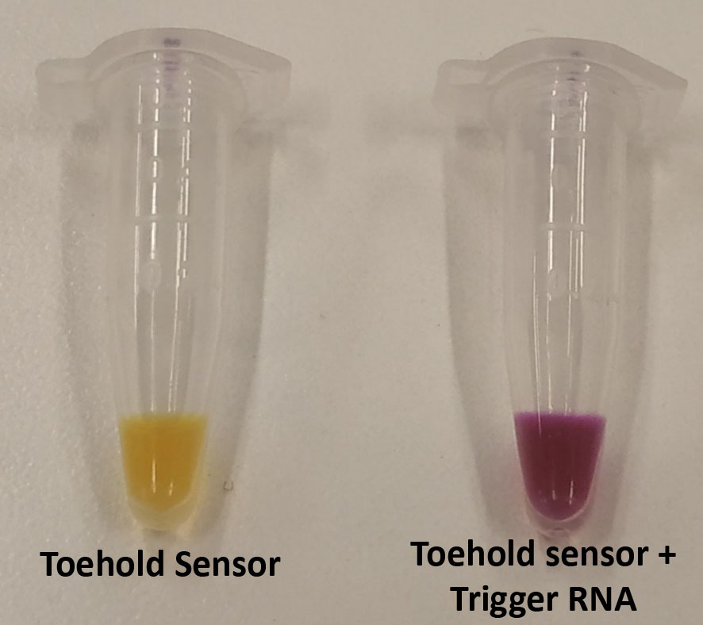
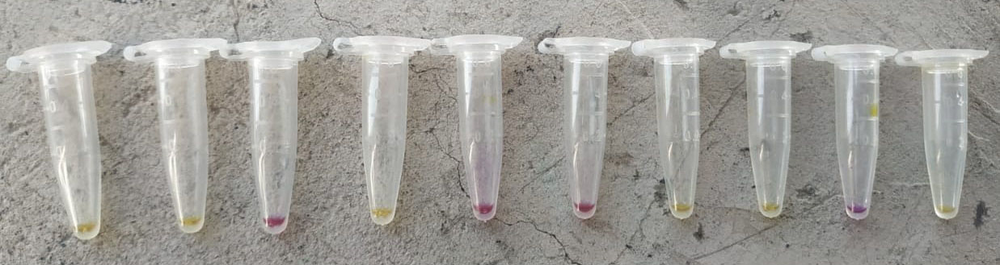

# Designing Novel Toehold Sensors 

Toehold riboswitches are a de-novo designed regulators of gene expression afecting translation. They have been used in many aplications including biocomputing and biosensors for RNA viruses including ébola, ZIka, Norovirus, PVY, and many more.

This repository is a open tool for designing novel toehold sensors for a given RNA. It interacts with NUPACK software for annalysis of RNA structures and all the code is writen in Python 3.0. 

# Dependencies
1.-NUPACK 3.0 (http://nupack.org/).

2.-Python 3

# Fast prototyping Toehold Sensors in cell-free reactions

Once toehold sensors are design, they can be fastlly screened in Cell-free reactions using PCR products, and In vitro transcribed trigger RNAs. We Use LacZ output, which gives a colorimetrics change from yellow ( negative controls ) to purple. 

Here is a link to the protocol we use for making in-house low-cost cell-free reactions https://www.protocols.io/view/preparation-of-cell-free-rnapt7-reactions-kz2cx8e

# References

Most of the code shown here is built on the top of an app from the iGem group EPFL (2017) http://2017.igem.org/Team:EPFL/Results/Toehold.

The scoring metrics for the designs were taken from  Ma, D. et al.  (Low-cost detection of norovirus using paper-based cell-free systems and synbody-based viral enrichment. Synth.  Biol.3, ysy018 (2018))

 
